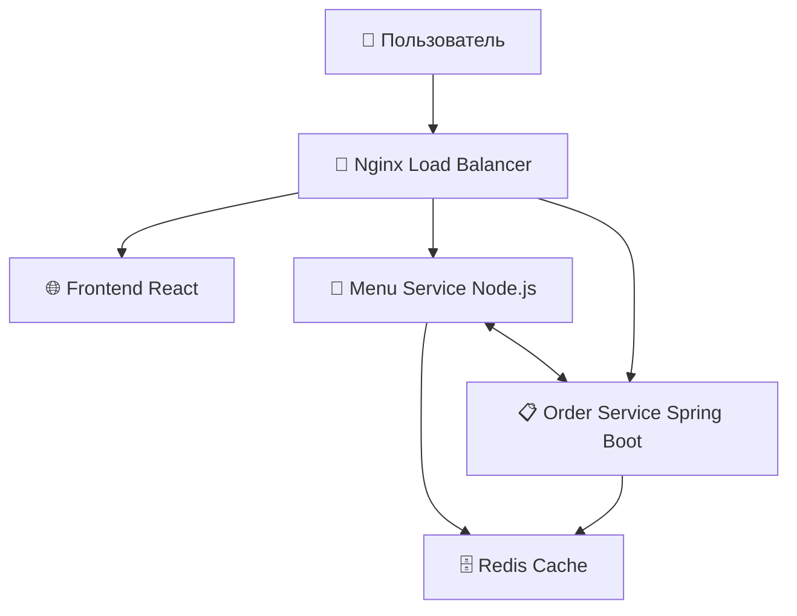

## Задание

В этом репозитории нет файла compose.yaml, а конфиг nginx/nginx.conf неполон.
Вам предстоит развернуть полностью рабочее окружение — для этого напишите compose.yaml и исправьте конфигурацию nginx

### Запуск

Для запуска используйте команду `docker compose up --build`

---

## 🌟 О проекте

Добро пожаловать в Галактическую Пиццерию – инновационную микросервисную систему заказа пиццы для межгалактических путешественников! В далеком будущем галактические путешественники нуждаются в быстрой доставке пиццы на космические станции, и наша система обеспечивает это с помощью современных технологий и архитектурных решений.

### 🎯 Возможности системы

- 🍕 **Просмотр меню космических пицц** - богатый каталог с межгалактическими вкусами
- 🛸 **Заказы с разных планет** - поддержка мультипланетарных доставок
- 📡 **Отслеживание через гиперпространство** - мониторинг статуса доставки в реальном времени
- 🤖 **Умные рекомендации** - персонализированные предложения на основе истории заказов
- ⚡ **Высокая производительность** - кэширование и балансировка нагрузки

---

## 🏗️ Архитектура системы




## 🚀 Компоненты системы

### 1. 🌐 Frontend Service (React)
**Технологии**: React 18, Bootstrap 5, Axios, React Router

**Функциональность**:
- Главная страница с меню космических пицц
- Интерактивная форма оформления заказа
- Страница отслеживания заказа в реальном времени
- Адаптивный дизайн для всех устройств

### 2. 🍕 Menu Service (Node.js/Express)
**Технологии**: Node.js, Express, Redis client

**API Endpoints**:
```
GET  /api/menu                    - получить все пиццы
GET  /api/menu/:id               - получить конкретную пиццу
GET  /api/recommendations/:userId - получить рекомендации
GET  /api/popular                - популярные позиции (из кэша)
```

**Функциональность**:
- Управление каталогом межгалактических пицц
- Интеллектуальное кэширование популярных позиций
- Интеграция с Order Service для статистики

### 3. 📋 Order Service (Java/Spring Boot)
**Технологии**: Spring Boot, Spring Data Redis, RestTemplate

**API Endpoints**:
```
POST /api/orders              - создать заказ
GET  /api/orders/:id         - получить заказ
GET  /api/orders/user/:userId - заказы пользователя
PUT  /api/orders/:id/status   - обновить статус заказа
```

**Функциональность**:
- Обработка и управление заказами
- Валидация позиций через Menu Service
- Расчет стоимости доставки по галактикам
- Отслеживание статуса доставки

### 4. 🗄️ Redis Cache
**Контейнер**: `redis-cache`

**Функциональность**:
- Кэширование меню и популярных позиций
- Хранение информации о заказах

### 5. 🔄 Nginx (Reverse Proxy)
**Контейнер**: `nginx-proxy`

**Роутинг**:
```
/api/menu/*   → Menu Service
/api/orders/* → Order Service
/*            → Frontend
```

**Функциональность**:
- Балансировка нагрузки между экземплярами сервисов

---
## 🛠️ Технологический стек

| Компонент | Технологии |
|-----------|------------|
| **Frontend** | React 18, Bootstrap 5, Axios, React Router |
| **Menu Service** | Node.js, Express.js, Redis Client |
| **Order Service** | Java 17, Spring Boot, Spring Data Redis |
| **Кэш** | Redis 7.0 |
| **Proxy** | Nginx |
---

## 📁 Структура проекта

```
galactic-pizza/
├── 📄 docker-compose.yml         # Основная конфигурация
├── 📖 README.md                  # Документация
├── 🌐 frontend/                  # React приложение
│   ├── 🐳 Dockerfile
│   ├── 📦 package.json
│   ├── 📦 nginx.conf
│   ├── 📁 src/
│   └── 📁 public/
├── 🍕 menu-service/              # Node.js сервис
│   ├── 🐳 Dockerfile
│   ├── 📦 package.json
│   └── 📁 src/
├── 📋 order-service/             # Spring Boot сервис
│   ├── 🐳 Dockerfile
│   ├── 📦 pom.xml
│   └── 📁 src/main/java/
├── 🔄 nginx/                     # Reverse proxy
│   ├── 🐳 Dockerfile
│   └── ⚙️ nginx.conf
├── 🗄️ redis/                     # Redis конфигурация
│   └── ⚙️ redis.conf
```

## 🔗 API документация

### Menu Service API
```
GET    /api/menu                     # Получить все пиццы
GET    /api/menu/:id                 # Получить пиццу по ID
GET    /api/recommendations/:userId  # Рекомендации для пользователя
GET    /api/popular                  # Популярные позиции
```

### Order Service API
```
POST   /api/orders                   # Создать новый заказ
GET    /api/orders/:id               # Получить заказ по ID
GET    /api/orders/user/:userId      # Заказы пользователя
PUT    /api/orders/:id/status        # Обновить статус заказа
```

---

## 👥 Команда разработчиков

**📧 Email**: support@galacticpizza.com  
**🌐 Website**: https://galacticpizza.com  
**🐙 GitHub**: https://github.com/galactic-pizza

---

## 📄 Лицензия

Этот проект создан в образовательных целях для демонстрации микросервисной архитектуры и работы с Docker Compose.

---

**🚀🍕 Наслаждайтесь вашей межгалактической пиццей!**

*"Доставляем во всей галактике быстрее скорости света!"* ⭐
